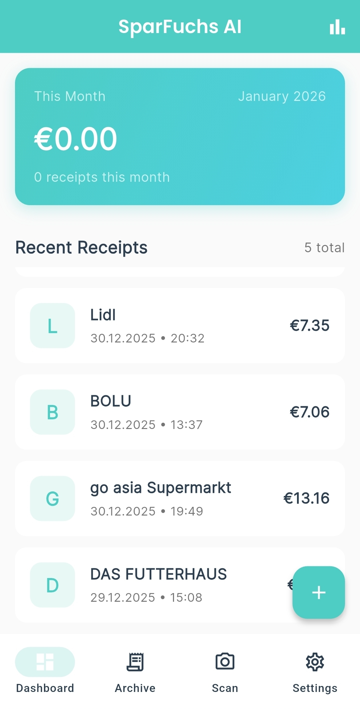
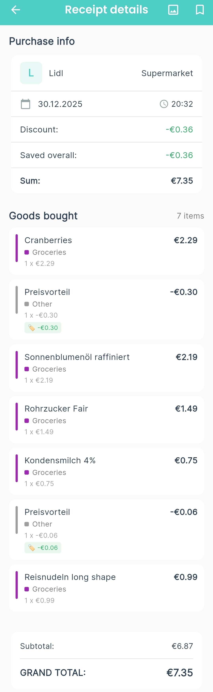
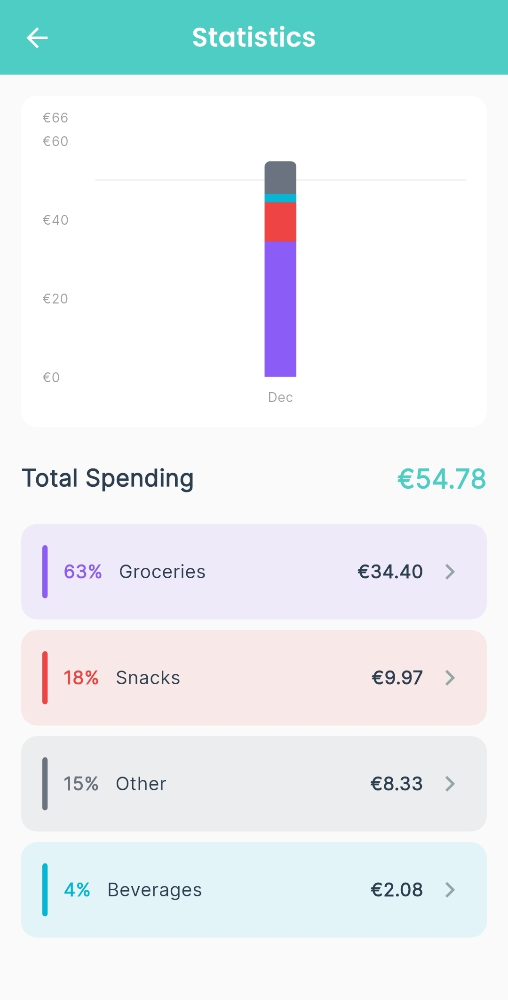
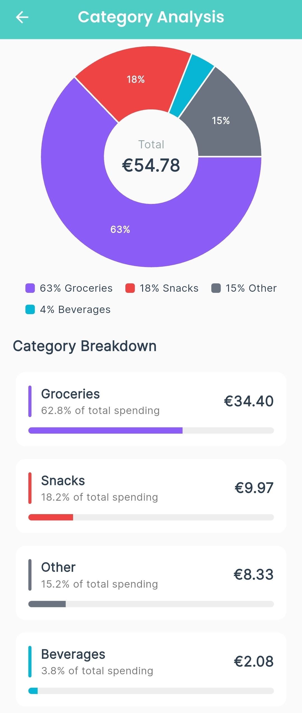
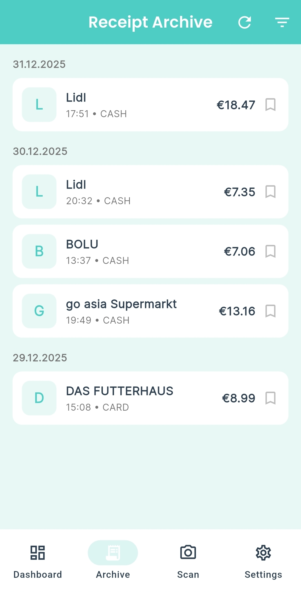
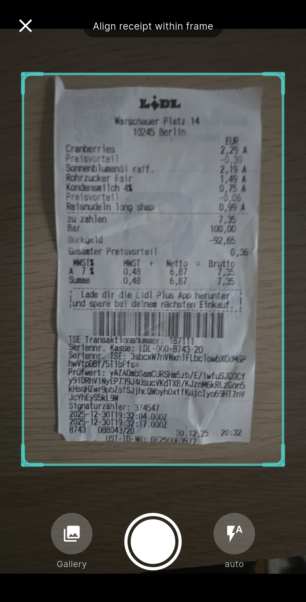

# SparFuchs AI 🦊

A smart receipt scanning and expense tracking app. Built with Flutter and powered by Gemini 2.5 Flash for accurate receipt parsing.

## Features

### ✅ Implemented

| Feature | Description |
|---------|-------------|
| 📸 **AI Receipt Scanning** | Gemini 2.5 Flash extracts items, prices, totals, categories |
| 🧾 **Receipt Details** | Premium UI with purchase info, goods list, category colors |
| 📊 **Statistics** | Stacked bar charts, category breakdown with percentages |
| 🥧 **Category Analysis** | Pie charts showing spending breakdown by category |
| 🔖 **Bookmarks** | Save favorite receipts, filter in Archive |
| 🏠 **Dashboard** | Monthly spending summary, recent receipts list |
| 🗂️ **Archive Filter** | Filter by bookmarks only and date range picker |
| 🗑️ **Clear Data** | Delete all receipts from Settings |
| 💾 **Local Storage** | Hive database (no cloud required, offline-first) |

### 🔜 Planned

- Household sharing for families
- Dark Mode theme
- PDF Export and Backup

## Tech Stack

| Component | Technology |
|-----------|------------|
| Frontend | Flutter + Riverpod |
| AI | Gemini 2.5 Flash |
| Storage | Hive (Local-first) |
| Charts | fl_chart |

## Architecture

```
Camera → Gemini API → Hive (Local DB)
                ↓
         Premium UI Screens
```

No backend server required. All data stored locally on device.

## Project Structure

```
lib/
  core/           # Models, constants, services
  features/
    dashboard/    # Monthly summary, statistics
    receipt/      # Scanning, archive, details, bookmarks
    settings/     # Data management
    inflation/    # Category analysis
  shared/         # Navigation, theme
```

## Getting Started

### Requirements

- Flutter SDK 3.x
- Gemini API key from [Google AI Studio](https://ai.google.dev)

### Setup

```bash
git clone https://github.com/HeartThanakorn/sparfuchs-mobile-app.git
cd sparfuchs-mobile-app

flutter pub get

# Create .env file
cp .env.example .env
# Add: GEMINI_API_KEY=your_key_here

flutter run
```

### Build APK

```bash
flutter build apk --release
```

APK location: `build/app/outputs/flutter-apk/app-release.apk`

## Screenshots

<p align="center">
  
  
  
</p>

<p align="center">
  
  
  
</p>

## Testing

```bash
flutter test
```

## Documentation

- `specs/requirements.md` - Feature requirements
- `specs/design.md` - Technical design
- `specs/tasks.md` - Implementation status

## License

Copyright 2025-2026 Thanakorn Thajan. All rights reserved.
