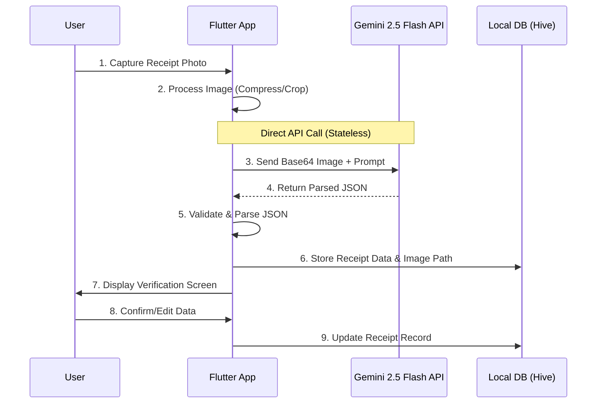
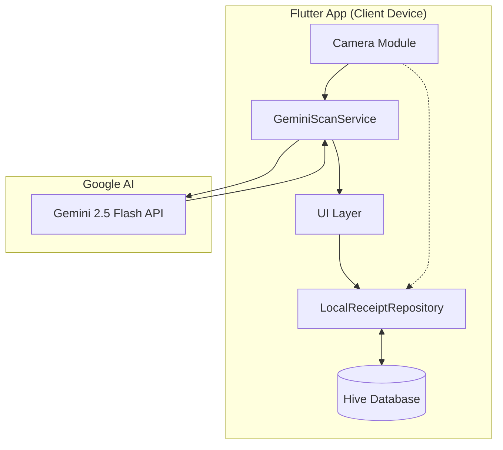

# Design Document: SparFuchs AI

## Overview

SparFuchs AI is a smart receipt scanning and expense tracking mobile application. The system employs a **local-first, serverless architecture** where AI processing calls Gemini 2.5 Flash API directly from Flutter, and all user data is stored locally on the device using Hive. This design ensures maximum privacy, offline capability, and zero backend maintenance costs.

## Architecture

### System Architecture Diagram



### Component Architecture



## Components and Interfaces

### 1. Flutter App Components

| Component                | Responsibility                             | Key Interfaces                                              |
| ------------------------ | ------------------------------------------ | ----------------------------------------------------------- |
| `CameraService`          | Capture receipt images, handle permissions | `captureImage()`, `pickFromGallery()`                       |
| `LocalReceiptRepository` | CRUD operations for receipts (Hive)        | `scanReceipt(file)`, `saveReceipt(data)`, `getAllReceipts`  |
| `GeminiScanService`      | AI Integration                             | `scanReceipt(imageFile)`                                    |

### 2. GeminiScanService (AI Integration)

| Method                | Purpose                                |
| --------------------- | -------------------------------------- |
| `scanReceipt(image)`  | Process receipt image via Gemini API   |
| `parseResponse(json)` | Parse AI response into ReceiptData     |

### 3. API Contract

#### Gemini API Request (from Flutter)

Direct usage of `google_generative_ai` package. The app sends the image + system prompt directly to Google's servers. No intermediate backend.

#### Parsed Response (ReceiptData)

```dart
// Returns the full receipt_data JSON as defined in Requirements
{
  "success": true,
  "receipt_data": { ... },  // Full schema
}
```

## Data Models

### Hive (Local Database) Schema

The app uses Hive for NoSQL-like local storage.

#### Box: `receipts`

Key: `receipt_id` (String, UUID)
Value: `Receipt` object (stored as JSON/Map)

```json
{
  "receipt_id": "rec_001",
  "image_path": "/data/user/0/.../app_flutter/images/rec_001.jpg",
  "is_bookmarked": false,
  "receipt_data": {
    "merchant": { ... },
    "transaction": { ... },
    "items": [ ... ],
    "totals": { ... }
  },
  "created_at": "2025-06-16T15:05:00Z",
  "updated_at": "2025-06-16T15:05:00Z"
}
```

### Flutter Data Models (Dart Classes)

```dart
// lib/core/models/receipt.dart
class Receipt {
  final String receiptId;
  final String userId; // Static 'local_user' for now
  final String? householdId; // Null (feature removed)
  final String imageUrl; // Local file path
  final bool isBookmarked;
  final ReceiptData receiptData;
  final DateTime createdAt;
  final DateTime updatedAt;
}

class ReceiptData {
  final Merchant merchant;
  final Transaction transaction;
  final List<LineItem> items;
  final Totals totals;
  final AiMetadata aiMetadata;
}
```

## UI/UX Design Guidelines

### Color Palette

| Color          | Hex       | Usage                           |
| -------------- | --------- | ------------------------------- |
| Primary Teal   | `#4ECDC4` | Primary actions, headers, brand |
| Dark Navy      | `#2C3E50` | Text, icons, navigation         |
| Light Mint     | `#E8F8F5` | Backgrounds, cards              |
| Success Green  | `#27AE60` | Savings, positive changes       |
| Warning Orange | `#F39C12` | Alerts, review needed           |
| Error Red      | `#E74C3C` | Errors, price increases         |
| Neutral Gray   | `#95A5A6` | Secondary text, borders         |

## The "Golden" AI System Prompt

This is the critical system prompt used in the application to parse German receipts:

```text
You are a specialized German receipt parser for the SparFuchs AI expense tracking app. Your task is to extract structured data from receipt images with high accuracy.
... [Standard System Prompt as defined in Code] ...
```

## Error Handling

| Error Type           | User Message                                      | Recovery Action                |
| -------------------- | ------------------------------------------------- | ------------------------------ |
| Image too blurry     | "Receipt image is unclear. Please retake."        | Prompt camera retry            |
| AI timeout           | "Processing took too long. Please try again."     | Retry with exponential backoff |
| Invalid JSON from AI | "Could not parse receipt. Please enter manually." | Show manual entry form         |
| Network error        | "No internet connection."                         | Queue for retry when online    |
