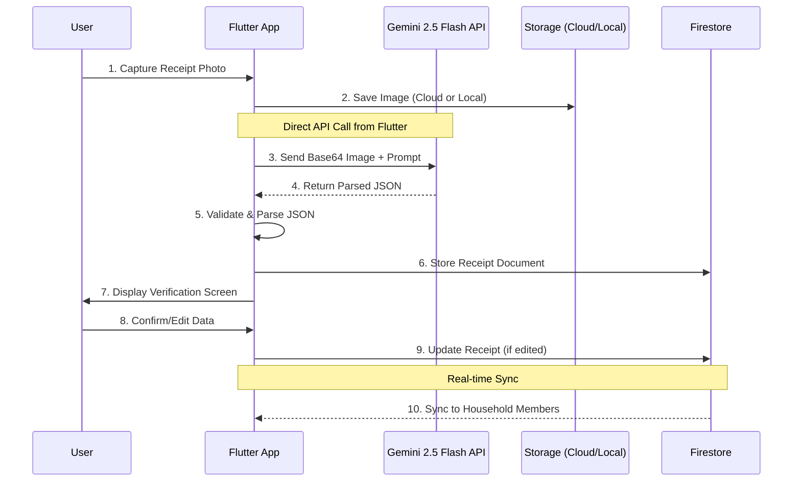
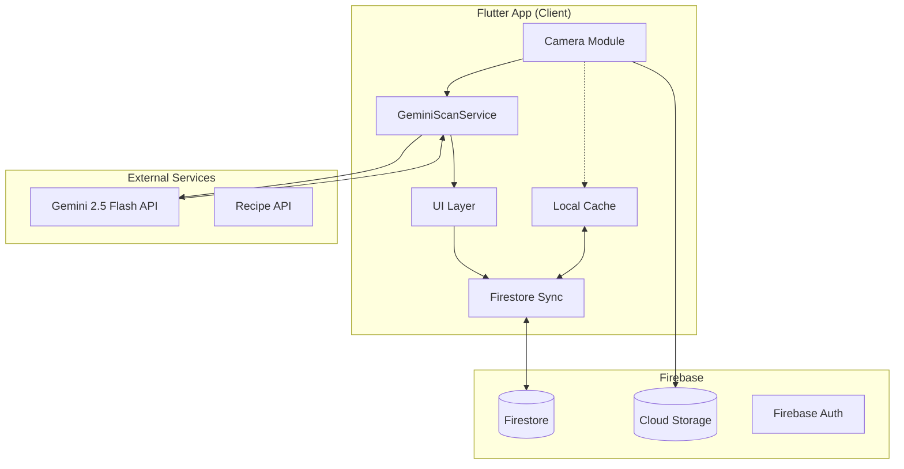

# Design Document: SparFuchs AI

## Overview

SparFuchs AI is a Flutter-based mobile application for the German market that uses AI-powered receipt scanning to digitize expenses. The system employs a serverless architecture where AI processing calls Gemini 2.5 Flash API directly from Flutter, while Firestore handles real-time mobile sync. This design ensures GDPR compliance through Firebase's EU data centers while maintaining responsive user experience.

The app differentiates from competitors through three killer features: Inflation Tracker (price history), Smart Recipe Suggestions, and Warranty/Return Monitoring.

## Architecture

### System Architecture Diagram



### Component Architecture



## Components and Interfaces

### 1. Flutter App Components

| Component             | Responsibility                             | Key Interfaces                                              |
| --------------------- | ------------------------------------------ | ----------------------------------------------------------- |
| `CameraService`       | Capture receipt images, handle permissions | `captureImage()`, `pickFromGallery()`                       |
| `ReceiptRepository`   | CRUD operations for receipts               | `scanReceipt(imageUrl)`, `saveImageLocally(file)`           |
| `HouseholdRepository` | Manage household sharing                   | `createHousehold()`, `joinHousehold(code)`, `getMembers()`  |
| `InflationService`    | Track product prices                       | `getPriceHistory(productId)`, `compareAcrossMerchants()`    |
| `WarrantyService`     | Manage return/warranty reminders           | `trackItem(item)`, `getUpcomingReminders()`                 |
| `RecipeService`       | Fetch recipe suggestions                   | `suggestRecipes(ingredients[])`                             |

### 2. GeminiScanService (AI Integration)

| Method                | Purpose                                |
| --------------------- | -------------------------------------- |
| `scanReceipt(image)`  | Process receipt image via Gemini API   |
| `parseResponse(json)` | Parse AI response into ReceiptData     |

### 3. API Contract

#### Gemini API Request (from Flutter)

Direct usage of `google_generative_ai` package (or raw HTTP REST for fine control).

```dart
// Direct call to Gemini 2.5 Flash API
final response = await http.post(
  Uri.parse('https://generativelanguage.googleapis.com/v1beta/models/gemini-2.5-flash-preview-05-20:generateContent'),
  headers: {'Content-Type': 'application/json'},
  body: jsonEncode({
    'contents': [{
      'parts': [
        {'inline_data': {'mime_type': 'image/jpeg', 'data': base64Image}},
        {'text': systemPrompt}
      ]
    }]
  }),
);
```

#### Parsed Response (ReceiptData)

```dart
// Returns the full receipt_data JSON as defined in Requirements 11
{
  "success": true,
  "receipt_data": { ... },  // Full schema
}
```

## Data Models

### Firestore Collections Schema

#### Collection: `users`

```json
{
  "user_id": "uid_123",
  "email": "user@example.de",
  "display_name": "Max Mustermann",
  "avatar_url": "https://...",
  "household_id": "hh_456",
  "settings": {
    "language": "de",
    "currency": "EUR",
    "notifications_enabled": true,
    "warranty_reminders": true,
    "recipe_suggestions": true
  },
  "created_at": "2025-06-16T10:00:00Z",
  "updated_at": "2025-06-16T10:00:00Z"
}
```

#### Collection: `households`

```json
{
  "household_id": "hh_456",
  "name": "Familie Müller",
  "join_code": "SPAR-ABC123",
  "owner_id": "uid_123",
  "members": [
    {
      "user_id": "uid_123",
      "role": "owner",
      "joined_at": "2025-06-16T10:00:00Z"
    },
    {
      "user_id": "uid_789",
      "role": "member",
      "joined_at": "2025-06-17T14:30:00Z"
    }
  ],
  "created_at": "2025-06-16T10:00:00Z"
}
```

#### Collection: `receipts`

```json
{
  "receipt_id": "rec_001",
  "user_id": "uid_123",
  "household_id": "hh_456",
  "image_url": "https://storage.googleapis.com/... OR /data/user/0/.../app_flutter/...",
  "is_bookmarked": false,
  "receipt_data": {
    "merchant": {
      "name": "Lidl",
      "branch_id": "DE-12345",
      "address": "Berliner Str. 10, 10115 Berlin",
      "raw_text": "Lidl Vertriebs-GmbH & Co. KG"
    },
    "transaction": {
      "date": "2025-06-16",
      "time": "15:00:00",
      "currency": "EUR",
      "payment_method": "CARD"
    },
    "items": [
      {
        "item_id": "item_001",
        "description": "Coca Cola 1,5l",
        "category": "Beverages",
        "quantity": 6,
        "unit_price": 1.19,
        "total_price": 7.14,
        "tags": ["soft_drink", "sugary"]
      },
      {
        "item_id": "item_002",
        "description": "Milka Hazelnut Chocolate",
        "category": "Snacks",
        "quantity": 1,
        "unit_price": 1.79,
        "total_price": 0.89,
        "discount": -0.9,
        "is_discounted": true
      },
      {
        "item_id": "item_003",
        "description": "Pfand",
        "category": "Deposit",
        "quantity": 6,
        "unit_price": 0.25,
        "total_price": 1.5,
        "type": "pfand_bottle"
      }
    ],
    "totals": {
      "subtotal": 35.8,
      "pfand_total": 1.5,
      "tax_amount": 2.55,
      "grand_total": 37.3
    },
    "taxes": [
      { "rate": 7.0, "amount": 1.5 },
      { "rate": 19.0, "amount": 1.05 }
    ],
    "ai_metadata": {
      "confidence_score": 0.98,
      "model_used": "gpt-4o",
      "processing_time_ms": 1200
    }
  },
  "created_at": "2025-06-16T15:05:00Z",
  "updated_at": "2025-06-16T15:05:00Z"
}
```

#### Collection: `products` (For Inflation Tracker)

```json
{
  "product_id": "prod_milk_lidl",
  "normalized_name": "Milch 1L",
  "category": "Groceries",
  "variants": ["Vollmilch", "H-Milch", "Frische Milch"],
  "price_history": [
    {
      "date": "2025-01-15",
      "price": 1.09,
      "merchant": "Lidl",
      "receipt_id": "rec_001"
    },
    {
      "date": "2025-03-20",
      "price": 1.19,
      "merchant": "Lidl",
      "receipt_id": "rec_045"
    },
    {
      "date": "2025-06-16",
      "price": 1.29,
      "merchant": "Lidl",
      "receipt_id": "rec_089"
    }
  ],
  "price_alerts": {
    "threshold_percent": 10,
    "last_alert_date": "2025-06-16"
  },
  "created_at": "2025-01-15T10:00:00Z",
  "updated_at": "2025-06-16T15:05:00Z"
}
```

#### Collection: `warranty_items`

```json
{
  "warranty_id": "war_001",
  "user_id": "uid_123",
  "receipt_id": "rec_050",
  "item_description": "Samsung Galaxy Buds",
  "category": "Electronics",
  "purchase_date": "2025-06-16",
  "return_deadline": "2025-06-30",
  "warranty_expiry": "2027-06-16",
  "status": "active",
  "reminders": [
    {
      "type": "return_window",
      "date": "2025-06-27",
      "sent": false
    },
    {
      "type": "warranty_expiry",
      "date": "2027-06-13",
      "sent": false
    }
  ],
  "created_at": "2025-06-16T15:05:00Z"
}
```

### Flutter Data Models (Dart Classes)

```dart
// lib/models/receipt.dart
class Receipt {
  final String receiptId;
  final String userId;
  final String? householdId;
  final String imageUrl;
  final bool isBookmarked;
  final ReceiptData receiptData;
  final DateTime createdAt;
  final DateTime updatedAt;
}

class ReceiptData {
  final Merchant merchant;
  final Transaction transaction;
  final List<LineItem> items;
  final Totals totals;
  final List<TaxEntry> taxes;
  final AiMetadata aiMetadata;
}

class Merchant {
  final String name;
  final String? branchId;
  final String? address;
  final String? rawText;
}

class Transaction {
  final String date;      // "2025-06-16"
  final String time;      // "15:00:00"
  final String currency;  // "EUR"
  final String paymentMethod; // "CASH" | "CARD"
}

class LineItem {
  final String itemId;
  final String description;
  final String category;
  final int quantity;
  final double unitPrice;
  final double totalPrice;
  final double? discount;
  final bool isDiscounted;
  final String? type;     // "pfand_bottle" for deposits
  final List<String>? tags;

  bool get isPfand => type == 'pfand_bottle';
}

class Totals {
  final double subtotal;
  final double pfandTotal;
  final double taxAmount;
  final double grandTotal;
}

class TaxEntry {
  final double rate;   // 7.0 or 19.0
  final double amount;
}

class AiMetadata {
  final double confidenceScore;
  final String modelUsed;
  final int processingTimeMs;

  bool get needsReview => confidenceScore < 0.8;
}
```

## UI/UX User Flows

### Flow A: Scan → Verify → Save Loop

```
┌─────────────────────────────────────────────────────────────────┐
│ SCREEN 1: HOME / DASHBOARD                                       │
│ ┌─────────────────────────────────────────────────────────────┐ │
│ │  [+] FAB Button (Scan Receipt)                              │ │
│ └─────────────────────────────────────────────────────────────┘ │
│                              ↓ Tap                               │
├─────────────────────────────────────────────────────────────────┤
│ SCREEN 2: CAMERA VIEW                                            │
│ ┌─────────────────────────────────────────────────────────────┐ │
│ │  • Full-screen camera preview                               │ │
│ │  • Receipt detection overlay (blue rectangle guide)         │ │
│ │  • Bottom bar: [Gallery] [Capture ●] [Flash]               │ │
│ │  • Auto-detect receipt edges (optional enhancement)         │ │
│ └─────────────────────────────────────────────────────────────┘ │
│                              ↓ Capture                           │
├─────────────────────────────────────────────────────────────────┤
│ SCREEN 3: PROCESSING OVERLAY                                     │
│ ┌─────────────────────────────────────────────────────────────┐ │
│ │  • Blurred receipt image background                         │ │
│ │  • Centered: Animated fox mascot + "Scanning..."            │ │
│ │  • Progress indicator (indeterminate)                       │ │
│ │  • "Analyzing your receipt with AI" text                    │ │
│ │  • Cancel button (bottom)                                   │ │
│ └─────────────────────────────────────────────────────────────┘ │
│                              ↓ AI Complete                       │
├─────────────────────────────────────────────────────────────────┤
│ SCREEN 4: VERIFICATION / RECEIPT DETAIL VIEW                     │
│ ┌─────────────────────────────────────────────────────────────┐ │
│ │  ⚠️ REVIEW NEEDED (if confidence < 0.8)                     │ │
│ │  ─────────────────────────────────────────────────────────  │ │
│ │  PURCHASE INFO                                              │ │
│ │  ┌─────────────────────────────────────────────────────┐   │ │
│ │  │ [L] Lidl                    Supermarket >           │   │ │
│ │  │ 📅 16.06.2025              🕐 15:00 >               │   │ │
│ │  │ Discount:                   -4,30 € >               │   │ │
│ │  │ Sum:                        37,30 €                 │   │ │
│ │  └─────────────────────────────────────────────────────┘   │ │
│ │                                                             │ │
│ │  GOODS BOUGHT                              12 items         │ │
│ │  ─────────────────────────────────────────────────────────  │ │
│ │  │ Coca Cola 1,5l                          7,14 € >  │      │ │
│ │  │ Soft Drinks                                        │      │ │
│ │  │ 6 x 1,19 €                                        │      │ │
│ │  ├────────────────────────────────────────────────────┤      │ │
│ │  │ Milka Hazelnut Chocolate                1,79 € >  │      │ │
│ │  │ Chocolate                    🏷️ -0,90 €           │      │ │
│ │  ├────────────────────────────────────────────────────┤      │ │
│ │  │ ♻️ DEPOSIT SECTION (Visual Separator)              │      │ │
│ │  ├────────────────────────────────────────────────────┤      │ │
│ │  │ ♻️ Pfand                                 0,50 € >  │      │ │
│ │  │ 2 x 0,25 €                                        │      │ │
│ │  ├────────────────────────────────────────────────────┤      │ │
│ │  │ ♻️ Leergut MW V. ST                    10,00 € >  │      │ │
│ │  │ 40 x 0,25 €                                       │      │ │
│ │  └────────────────────────────────────────────────────┘      │ │
│ │                                                             │ │
│ │  TOTALS                                                     │ │
│ │  ┌─────────────────────────────────────────────────────┐   │ │
│ │  │ Subtotal:                              35,80 €      │   │ │
│ │  │ ♻️ Pfand Total:                         1,50 €      │   │ │
│ │  │ ─────────────────────────────────────────────────   │   │ │
│ │  │ GRAND TOTAL:                           37,30 €      │   │ │
│ │  └─────────────────────────────────────────────────────┘   │ │
│ │                                                             │ │
│ │  [💾 Save Receipt]  [🍳 Get Recipes]                        │ │
│ └─────────────────────────────────────────────────────────────┘ │
└─────────────────────────────────────────────────────────────────┘
```

### Flow B: Inflation Tracker

```
┌─────────────────────────────────────────────────────────────────┐
│ SCREEN 1: INFLATION TRACKER HOME                                 │
│ ┌─────────────────────────────────────────────────────────────┐ │
│ │  🔍 Search products...                                      │ │
│ │  ─────────────────────────────────────────────────────────  │ │
│ │  TRENDING PRICE CHANGES                                     │ │
│ │  ┌─────────────────────────────────────────────────────┐   │ │
│ │  │ 🥛 Milch 1L           ↑ +18% (6 months)   1,29 €    │   │ │
│ │  │ 🧈 Butter 250g        ↑ +12% (6 months)   2,49 €    │   │ │
│ │  │ 🍞 Brot               ↓ -3% (6 months)    1,89 €    │   │ │
│ │  └─────────────────────────────────────────────────────┘   │ │
│ │                                                             │ │
│ │  YOUR TRACKED PRODUCTS                                      │ │
│ │  ┌─────────────────────────────────────────────────────┐   │ │
│ │  │ Coca Cola 1,5L        Last: 1,19 € at Lidl          │   │ │
│ │  │ Nutella 450g          Last: 3,99 € at Rewe          │   │ │
│ │  └─────────────────────────────────────────────────────┘   │ │
│ └─────────────────────────────────────────────────────────────┘ │
│                              ↓ Tap Product                       │
├─────────────────────────────────────────────────────────────────┤
│ SCREEN 2: PRODUCT PRICE HISTORY                                  │
│ ┌─────────────────────────────────────────────────────────────┐ │
│ │  ← Back                                                     │ │
│ │  ─────────────────────────────────────────────────────────  │ │
│ │  🥛 Milch 1L                                                │ │
│ │  Category: Groceries                                        │ │
│ │                                                             │ │
│ │  PRICE CHART                                                │ │
│ │  ┌─────────────────────────────────────────────────────┐   │ │
│ │  │     €                                                │   │ │
│ │  │  1.30│                                    ●          │   │ │
│ │  │  1.20│                        ●                      │   │ │
│ │  │  1.10│            ●                                  │   │ │
│ │  │  1.00│  ●                                            │   │ │
│ │  │      └────────────────────────────────────────────   │   │ │
│ │  │        Jan    Mar    May    Jun                      │   │ │
│ │  └─────────────────────────────────────────────────────┘   │ │
│ │                                                             │ │
│ │  PRICE BY MERCHANT                                          │ │
│ │  ┌─────────────────────────────────────────────────────┐   │ │
│ │  │ Lidl          1,29 €    (16.06.2025)                │   │ │
│ │  │ Aldi          1,25 €    (14.06.2025)   ⭐ Cheapest  │   │ │
│ │  │ Rewe          1,39 €    (10.06.2025)                │   │ │
│ │  └─────────────────────────────────────────────────────┘   │ │
│ │                                                             │ │
│ │  [🔔 Set Price Alert]                                       │ │
│ └─────────────────────────────────────────────────────────────┘ │
└─────────────────────────────────────────────────────────────────┘
```

### Flow C: Recipe Suggestions (Post-Scan)

```
┌─────────────────────────────────────────────────────────────────┐
│ SCREEN: RECIPE SUGGESTIONS (Modal/Bottom Sheet)                  │
│ ┌─────────────────────────────────────────────────────────────┐ │
│ │  🍳 Recipe Ideas from Your Purchase                         │ │
│ │  Based on: Tomatoes, Pasta, Cheese, Basil                   │ │
│ │  ─────────────────────────────────────────────────────────  │ │
│ │  ┌─────────────────────────────────────────────────────┐   │ │
│ │  │ [🖼️]  Pasta Caprese                                 │   │ │
│ │  │       Uses: Tomatoes, Pasta, Cheese, Basil          │   │ │
│ │  │       ⏱️ 25 min  |  👤 4 servings                   │   │ │
│ │  └─────────────────────────────────────────────────────┘   │ │
│ │  ┌─────────────────────────────────────────────────────┐   │ │
│ │  │ [🖼️]  Tomato Basil Soup                             │   │ │
│ │  │       Uses: Tomatoes, Basil                         │   │ │
│ │  │       ⏱️ 30 min  |  👤 6 servings                   │   │ │
│ │  └─────────────────────────────────────────────────────┘   │ │
│ │  ┌─────────────────────────────────────────────────────┐   │ │
│ │  │ [🖼️]  Cheese Stuffed Tomatoes                       │   │ │
│ │  │       Uses: Tomatoes, Cheese                        │   │ │
│ │  │       ⏱️ 40 min  |  👤 4 servings                   │   │ │
│ │  └─────────────────────────────────────────────────────┘   │ │
│ │                                                             │ │
│ │  [Skip]                              [View All Recipes →]   │ │
│ └─────────────────────────────────────────────────────────────┘ │
└─────────────────────────────────────────────────────────────────┘
```

## UI/UX Design Guidelines

### Color Palette (Fintech-Inspired, Trustworthy)

| Color          | Hex       | Usage                           |
| -------------- | --------- | ------------------------------- |
| Primary Teal   | `#4ECDC4` | Primary actions, headers, brand |
| Dark Navy      | `#2C3E50` | Text, icons, navigation         |
| Light Mint     | `#E8F8F5` | Backgrounds, cards              |
| Success Green  | `#27AE60` | Savings, positive changes       |
| Warning Orange | `#F39C12` | Alerts, review needed           |
| Error Red      | `#E74C3C` | Errors, price increases         |
| Neutral Gray   | `#95A5A6` | Secondary text, borders         |
| White          | `#FFFFFF` | Card backgrounds                |

### Typography

- Headlines: `Poppins Bold` (600)
- Body: `Inter Regular` (400)
- Numbers/Prices: `SF Mono` or `Roboto Mono`

### Design Principles

1.  **Clean & Minimal**: White space, clear hierarchy
2.  **Trustworthy**: Consistent patterns, no dark patterns
3.  **Accessible**: WCAG 2.1 AA compliant, min 44px touch targets
4.  **German-Friendly**: Support for long compound words, proper number formatting (1.234,56 €)

## The "Golden" AI System Prompt

This is the critical system prompt used in the application to parse German receipts:

```text
You are a specialized German receipt parser for the SparFuchs AI expense tracking app. Your task is to extract structured data from receipt images with high accuracy.

## OUTPUT FORMAT
Return ONLY valid JSON matching this exact schema (no markdown, no explanations):

{
  "receipt_data": {
    "merchant": {
      "name": "<Store name: Lidl, Aldi, Rewe, DM, Edeka, Penny, Netto, Kaufland, etc.>",
      "branch_id": "<Store ID if visible, e.g., 'DE-12345'>",
      "address": "<Full address if visible>",
      "raw_text": "<Exact merchant text as printed>"
    },
    "transaction": {
      "date": "<YYYY-MM-DD format>",
      "time": "<HH:MM:SS 24h format>",
      "currency": "EUR",
      "payment_method": "<CASH or CARD>"
    },
    "items": [
      {
        "description": "<Product name - CORRECTED for OCR errors>",
        "category": "<Groceries|Beverages|Snacks|Household|Electronics|Fashion|Deposit|Other>",
        "quantity": <number>,
        "unit_price": <number with 2 decimals>,
        "total_price": <number with 2 decimals>,
        "discount": <negative number if discounted, null otherwise>,
        "is_discounted": <true/false>,
        "type": "<'pfand_bottle' for deposits, null otherwise>",
        "tags": ["<relevant tags>"]
      }
    ],
    "totals": {
      "subtotal": <number>,
      "pfand_total": <number - sum of all Pfand items>,
      "tax_amount": <number>,
      "grand_total": <number>
    },
    "taxes": [
      {"rate": 7.0, "amount": <food tax amount>},
      {"rate": 19.0, "amount": <non-food tax amount>}
    ],
    "ai_metadata": {
      "confidence_score": <0.0-1.0 based on image quality and parsing certainty>,
      "model_used": "gemini-2.5-flash",
      "processing_time_ms": null
    }
  }
}

## GERMAN RECEIPT PARSING RULES

### 1. PFAND (Deposit) Detection - CRITICAL
Identify ALL Pfand/deposit items. Common patterns:
- "Pfand", "PFAND", "Pfd", "Leergut"
- "Einweg", "Einwegpfand", "EW-Pfand" (€0.25)
- "Mehrweg", "Mehrwegpfand", "MW-Pfand" (€0.08-€0.15)
- Items with exactly €0.25, €0.15, or €0.08 unit price near beverages
- Set type: "pfand_bottle" and category: "Deposit" for ALL deposit items

### 2. OCR Error Corrections - MANDATORY
Fix common German receipt OCR errors:
- "Mwich" → "Milch"
- "8rot", "Br0t" → "Brot"
- "Kase", "K4se" → "Käse"
- Numbers confused with letters: 0↔O, 1↔l, 5↔S, 8↔B

### 3. German Abbreviations - EXPAND
- "Stk" / "St." → "Stück"
- "Pck" / "Pkg" → "Packung"
- "Fl." → "Flasche"
- "Bio" → Keep as "Bio"
- "TK" → "Tiefkühl"

### 4. Tax Rate Classification
- 7% (ermäßigt): Food, beverages, books
- 19% (normal): Non-food items, electronics

### 5. Discount Detection
- Look for: "Rabatt", "Aktion", "Angebot", "Reduziert", "-", "Ersparnis"
- Set is_discounted: true and capture discount as negative number

- Groceries: Obst, Gemüse, Fleisch, Fisch, Milchprodukte, Brot, Eier
- Beverages: Wasser, Saft, Bier, Wein, Softdrinks, Kaffee, Tee
- Snacks: Schokolade, Chips, Süßigkeiten, Kekse
- Household: Reiniger, Waschmittel, Toilettenpapier, Müllbeutel
- Electronics: Batterien, Kabel, Elektronik
- Fashion: Kleidung, Schuhe, Accessoires

### 7. Payment Method Detection
- "BAR", "Bargeld" → "CASH"
- "EC", "Karte", "VISA", "Mastercard", "girocard", "Kartenzahlung" → "CARD"

### 8. Confidence Score Guidelines
- 1.0: Crystal clear image, all fields parsed confidently
- 0.8-0.9: Good quality, minor uncertainties
- 0.6-0.8: Some blurry areas, guessing required
- <0.6: Poor quality, significant guessing

## VALIDATION RULES
1. grand_total MUST equal subtotal + pfand_total (approximately, accounting for rounding)
2. Each item's total_price MUST equal quantity × unit_price (minus discount if applicable)
3. All prices MUST be positive numbers (except discount which is negative)
4. Date MUST be valid and not in the future
5. If parsing fails for critical fields, set confidence_score below 0.5

## EXAMPLE OUTPUT
For a Lidl receipt with milk, bread, and bottle deposit:

{
  "receipt_data": {
    "merchant": {
      "name": "Lidl",
      "branch_id": "DE-8834",
      "address": "Hauptstraße 15, 80331 München",
      "raw_text": "Lidl Vertriebs-GmbH & Co. KG"
    },
    "transaction": {
      "date": "2025-06-16",
      "time": "14:32:00",
      "currency": "EUR",
      "payment_method": "CARD"
    },
    "items": [
      {
        "description": "Frische Vollmilch 1L",
        "category": "Groceries",
        "quantity": 2,
        "unit_price": 1.29,
        "total_price": 2.58,
        "discount": null,
        "is_discounted": false,
        "type": null,
        "tags": ["dairy", "milk"]
      },
      {
        "description": "Pfand Einweg",
        "category": "Deposit",
        "quantity": 6,
        "unit_price": 0.25,
        "total_price": 1.50,
        "discount": null,
        "is_discounted": false,
        "type": "pfand_bottle",
        "tags": ["deposit", "einweg"]
      }
    ],
    "totals": {
      "subtotal": 2.58,
      "pfand_total": 1.50,
      "tax_amount": 0.18,
      "grand_total": 4.08
    },
    "taxes": [
      {"rate": 7.0, "amount": 0.18}
    ],
    "ai_metadata": {
      "confidence_score": 0.95,
      "model_used": "gpt-4o",
      "processing_time_ms": null
    }
  }
}
```

## Error Handling

### API Error Handling

| Error Type           | HTTP Code | User Message                                      | Recovery Action                |
| -------------------- | --------- | ------------------------------------------------- | ------------------------------ |
| Image too blurry     | 422       | "Receipt image is unclear. Please retake."        | Prompt camera retry            |
| AI timeout           | 504       | "Processing took too long. Please try again."     | Retry with exponential backoff |
| Invalid JSON from AI | 500       | "Could not parse receipt. Please enter manually." | Show manual entry form         |
| Network error        | 0         | "No internet connection."                         | Queue for retry when online    |
| Rate limit           | 429       | "Too many requests. Please wait."                 | Show countdown timer           |

### Data Validation Errors

| Validation       | Error Message                         | Auto-Fix              |
| ---------------- | ------------------------------------- | --------------------- |
| Total mismatch   | "Totals don't add up. Please verify." | Highlight discrepancy |
| Future date      | "Date appears to be in the future."   | Suggest current date  |
| Missing merchant | "Store name not detected."            | Prompt manual entry   |
| Zero items       | "No items detected on receipt."       | Show manual entry     |

## Testing Strategy

### Dual Testing Approach

This project requires both unit tests and property-based tests for comprehensive coverage:

- **Unit tests**: Verify specific examples, edge cases, and error conditions
- **Property tests**: Verify universal properties across all inputs using `fast-check` library

### Property-Based Testing Configuration

- Library: `fast-check` for Dart/Flutter
- Minimum iterations: 100 per property test
- Each test tagged with: `Feature: sparfuchs-ai, Property {N}: {description}`

## Correctness Properties

_A property is a characteristic or behavior that should hold true across all valid executions of a system—essentially, a formal statement about what the system should do. Properties serve as the bridge between human-readable specifications and machine-verifiable correctness guarantees._

### Property 1: Receipt Field Extraction Completeness

_For any_ valid receipt image that produces a successful parse, the resulting ReceiptData object SHALL contain non-null values for: merchant.name, transaction.date, transaction.time, and at least one item with description, quantity, unit_price, and total_price.

**Validates: Requirements 1.2, 1.3**

### Property 2: Pfand Item Classification

_For any_ LineItem where the description contains "Pfand", "Leergut", "Einweg", or "Mehrweg" (case-insensitive), the item SHALL have type equal to "pfand_bottle" and category equal to "Deposit".

**Validates: Requirements 1.4**

### Property 3: Discount Field Consistency

_For any_ LineItem where is_discounted is true, the discount field SHALL be a negative number. Conversely, _for any_ LineItem where discount is a negative number, is_discounted SHALL be true.

**Validates: Requirements 1.5**

### Property 4: Tax Rate Categorization

_For any_ TaxEntry in the taxes array, the rate SHALL be either 7.0 (food/reduced) or 19.0 (standard). The sum of all tax amounts SHALL equal totals.tax_amount (within €0.02 tolerance for rounding).

**Validates: Requirements 1.6**

### Property 5: Confidence Score Review Trigger

_For any_ AiMetadata where confidence_score is less than 0.8, the needsReview computed property SHALL return true. _For any_ confidence_score >= 0.8, needsReview SHALL return false.

**Validates: Requirements 1.7**

### Property 6: Total Recalculation on Edit

_For any_ Receipt and any edit to a LineItem's quantity or unit_price, the recalculated total_price SHALL equal quantity × unit_price (minus discount if applicable), and totals.subtotal SHALL equal the sum of all non-Pfand item total_prices.

**Validates: Requirements 2.6**

### Property 7: Receipt Serialization Round-Trip

_For any_ valid Receipt object, serializing to JSON and then deserializing back SHALL produce an object that is equivalent to the original (all fields match).

**Validates: Requirements 2.7, 11.1, 11.2, 11.3**

### Property 8: Category Percentage Calculation

_For any_ set of receipts in a time period, the sum of all category percentages SHALL equal 100% (within 1% tolerance for rounding), and each category's Euro amount SHALL equal (percentage/100) × total spending.

**Validates: Requirements 3.3, 3.4**

### Property 9: Receipt Archive Sort Order

_For any_ list of receipts returned by the archive, the receipts SHALL be sorted by transaction.date in descending order (newest first). For receipts with the same date, they SHALL be sorted by transaction.time descending.

**Validates: Requirements 4.1**

### Property 10: Search Filter Accuracy

_For any_ search query on the Receipt_Archive, all returned receipts SHALL match at least one of: merchant.name contains query, any item.description contains query, or transaction.date falls within specified date range.

**Validates: Requirements 4.3**

### Property 11: Bookmark Persistence

_For any_ receipt that is bookmarked, querying the bookmarks view SHALL include that receipt. _For any_ receipt that is not bookmarked, it SHALL NOT appear in the bookmarks view.

**Validates: Requirements 4.5**

### Property 12: Household Invite Code Uniqueness

_For any_ N households created, all N invite codes SHALL be unique (no duplicates).

**Validates: Requirements 5.1**

### Property 13: Household Membership After Join

_For any_ user who joins a household via valid invite code, that user's user_id SHALL appear in the household's members array, and the user's household_id SHALL equal the household's household_id.

**Validates: Requirements 5.2**

### Property 14: Household Receipt Sync

_For any_ receipt created by any member of a household, querying receipts for any other member of the same household SHALL include that receipt.

**Validates: Requirements 5.3**

### Property 15: Household Spending Aggregation

_For any_ household, the dashboard total spending SHALL equal the sum of grand_total from all receipts where household_id matches.

**Validates: Requirements 5.5**

### Property 16: Household Leave Data Isolation

_For any_ user who leaves a household, their previously created receipts SHALL remain accessible to them, but receipts created by other former household members SHALL NOT be accessible.

**Validates: Requirements 5.6**

### Property 17: Price History Recording

_For any_ product that appears in N different receipts, the product's price_history array SHALL contain exactly N entries, each with the correct date, price, and merchant from the corresponding receipt.

**Validates: Requirements 6.1**

### Property 18: Inflation Alert Threshold

_For any_ product where the latest price is more than 10% higher than the price from 6 months ago, the price_alerts.last_alert_date SHALL be updated and a warning indicator SHALL be shown.

**Validates: Requirements 6.3**

### Property 19: Price Comparison and Percentage Calculation

_For any_ product with prices from multiple merchants, all merchant prices SHALL be displayed. The percentage change SHALL equal ((new_price - old_price) / old_price) × 100, rounded to one decimal place.

**Validates: Requirements 6.4, 6.5**

### Property 20: Recipe Suggestion Count and Relevance

_For any_ receipt containing at least one food item, exactly 3 recipe suggestions SHALL be returned. The suggestions SHALL be sorted by number of matching ingredients (descending).

**Validates: Requirements 7.1, 7.2**

### Property 21: Warranty Item Detection and Reminder Setup

_For any_ LineItem with category "Electronics" or "Fashion", a warranty_item record SHALL be created with: return_deadline = purchase_date + 14 days. For "Electronics" items, warranty_expiry SHALL equal purchase_date + 2 years.

**Validates: Requirements 8.1, 8.2, 8.3**

### Property 22: Days Remaining Calculation

_For any_ warranty_item, the displayed days_remaining for return_deadline SHALL equal return_deadline minus current_date. The displayed days_remaining for warranty_expiry SHALL equal warranty_expiry minus current_date.

**Validates: Requirements 8.5**

### Property 23: Reminder Cancellation on Return

_For any_ warranty_item marked as status "returned", all associated reminders SHALL have sent = true or be removed from the reminders array.

**Validates: Requirements 8.6**

### Property 24: Malformed JSON Error Handling

_For any_ malformed JSON string passed to the Receipt_Parser, the parser SHALL return an error result containing a descriptive message indicating the parsing failure location (line/character position if available).

**Validates: Requirements 11.4**
